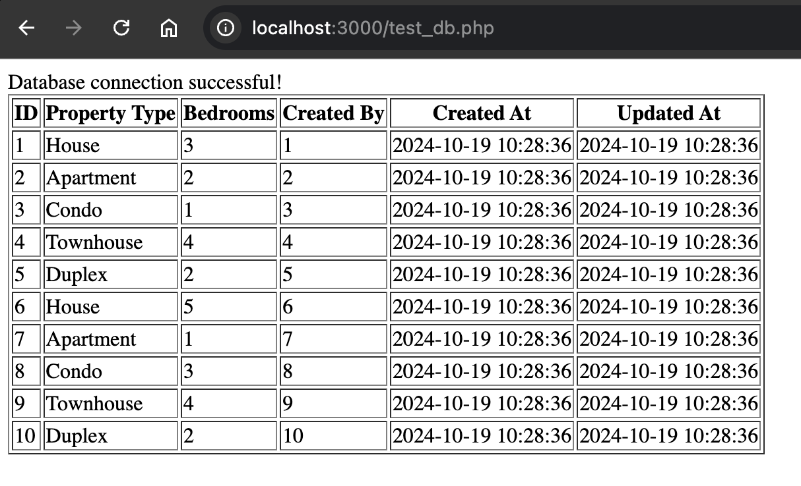

# Part 2: Creating a Docker environment for development

## Requirement 1: Runs the latest version of PHP with extra modules:

Modules required:
- curl
- gd
- intl
- mbstring
- mysqlnd
- zip

**1. Go to Dockerhub and find the official [php image](https://hub.docker.com/_/php)**

Choosing an image:
> Linux Distribution

I generally prefer Alpine images for web applications because they are much smaller and you have full control over what software you choose to include.
Smaller image sizes will generally mean better performance in this context.

> Version tag

You can omit the php version number in the image tag and it will resolve to the current latest stable release of php, which is currently v8.3.12.
Personally I prefer to explicitly state the php version, as this will mitigate risk of breaking changes as new versions release.

The php image I will be using is `php:8.3.12-alpine`

**2. Install the dependencies**

From the docker hub documentation, section: `How to install more PHP extensions` as this is an official php image, extension helper scripts are included.
However, extra system packages need to be installed manually as dependencies and it can be difficult to know what packages are required.

Luckily, they reference a very handy tool in the documents to simplify this process: [docker-php-extension-installer](https://github.com/mlocati/docker-php-extension-installer) which handles installing all the dependencies for you.

**3. Verification**

Shell into the container and verify that the modules have installed successfully

```sh
# Output the php modules in the container
$ docker run -it <container> sh -c "php -m"
```

On a clean install of php v8.3.12, some of the required modules are already included.
I've included all the required modules in the Dockerfile to be explicit.
The system's default behaviour is to skip these modules as they are already installed.

## Requirement 2: Can handle inbound http requests on a configurable port (default to 80).

**1. Configure an Environment variable which the user can use to expose connections to, and set default value as 80.**

```Dockerfile
ENV HTTP_PORT 80
EXPOSE $HTTP_PORT
```

#### ENV vs ARG

Either keywords `ENV` or `ARG` can be used to set the `HTTP_PORT` variable.
I have favoured `ENV` in this scenario because using `ARG` would be setting the port at build-time.
It is more flexible to set this port at runtime using `ENV` in a development context becacuse changing this port would not require an image rebuild.

**2. Verification**

Create a "Hello World" php script to verify changes on the browser. Save as `index.php`

Run `php -S 0.0.0.0:${HTTP_PORT}` in the container to start up php with the inbuilt webserver.

```sh
# Default port value
docker run -d -p 80:80 <container>
```
> We should see "Hello World!" when we navigate to localhost:80 on our browser

```sh
# Custom port value
PORT=1234; docker run -d -p $PORT:$PORT -e HTTP_PORT=$PORT <container>
```
> We should see "Hello World!" when we navigate to localhost:1234 on our browser

## Requirement 3: Default index page displays phpinfo

**1. Update `index.php` to display `phpinfo()`**

Changes should be visible when re-building and re-running the container.

## Requirement 4: PHP_ENV environment variable

**1. Add the environment variable to the Dockerfile.**

```Dockerfile
ENV PHP_ENV=development
```

**2. Verification**

The phpinfo index page should display current environment variables.

Verify that on default settings, `PHP_ENV` value is `development`.

Verify the value updates when provided a value at runtime:
```sh
docker run -d -p 80:80 -e PHP_ENV=production <container>
```
The `PHP_ENV` value on the index page should resolve to `production`.

## Requirement 5: Custom entrypoint to install vendor dependencies via Composer

**1. Install Composer in the container**

The Composer docs provide a [handy resource](https://getcomposer.org/doc/00-intro.md#docker-image) for installing this tool on Docker containers

For the same reason as not using the `latest` tag above, we'll pull the current latest version's binary, which is v2.8.1

Add the following line to our Dockerfile to install Composer:
```Dockerfile
COPY --from=composer/composer:2.8.1-bin /composer /usr/bin/composer
```

**2. Create the custom entrypoint**

**2a. Write the entrypoint script**

```sh
#!/usr/bin/env sh

set -e

# Install composer dependencies if composer.json exists
if [ -f "composer.json" ]; then
    echo "Installing Composer dependencies..."
    composer install --no-interaction
fi

# Start the PHP built-in web server
php -S 0.0.0.0:$HTTP_PORT
```

Let's break it down.

The shebang: `#!/usr/bin/env sh` points to the base shell in the user's environment.
This type of shebang is more portable because it does not hard code the path to the shell interpreter.
We also use the base `sh` over `bash` because `alpine` does not come with `bash`.

`set -e` is for error handling. This tells the script to exit if any command fails.
We would rather fail early if `composer` encounters an error and the web-server starts anyway.
That behaviour would make it difficult to debug why `composer` packages are not being loaded.

```sh
if [ -f "composer.json" ]; then
    echo "Installing Composer dependencies..."
    composer install --no-interaction
fi
```

Looks for the presence of a `composer.json` file. If it exists then install the dependencies using the `install` command.
`--no-interaction` will use the default value if user interaction is required.

`php -S 0.0.0.0:$HTTP_PORT`: Then carry on with starting up the in-built webserver as before. The `$HTTP_PORT` environment variable should be passed into the script from the container.

**2b. Ensure the script is executable**

Run `chmod +x ./docker-entrypoint.sh`

**2c. Update the entrypoint**

```Dockerfile
COPY ./docker-entrypoint.sh /usr/local/bin/docker-entrypoint

ENTRYPOINT [ "docker-entrypoint" ]
```

**3. Verification**

**3a. Create a `composer.json` file for testing**

```json
{
    "require": {
        "monolog/monolog": "^3.7"
    }
}
```

I have used version 3.7 as the original `v2.0.*` in the example given is not compatible with this latest version of php.

**3b. Create a `test_monolog.php` file to test the dependencies are install on the container**

**3c. Verify the package works**

```sh
# Build, then start the container
docker run -d -p 80:80 <container>

# Go to localhost:80/test_monolog.php on your browser
# Check the container logs
docker logs <container>

> [2024-10-18T04:54:33.016079+00:00] test.INFO: Monolog is successfully installed and working! [] []
> [Fri Oct 18 04:54:33 2024] 172.17.0.1:54360 [200]: GET /test_monolog.php
> [Fri Oct 18 04:54:33 2024] 172.17.0.1:54360 Closing
> [Fri Oct 18 04:54:33 2024] 172.17.0.1:54366 Accepted
```
Success!

## Requirement 6: Add Docker compose config and a MariaDB service

**1. Convert the current Dockerfile to a `docker-compose` setup.**

```yaml
# docker-compose.yaml
services:
  app:
    build: .
    ports:
      - "${HOST_PORT:-80}:${CONTAINER_PORT:-80}"
    environment:
      HTTP_PORT: ${CONTAINER_PORT:-80}
      PHP_ENV: ${PHP_ENV:-development}
```

In this configuration, we are taking advantage of docker-compose's ability to automatically read a `.env` file to set environment variables.
If the environment variable is not present in the file, we have also provided a default value.

```sh
# .env
HOST_PORT=3000
CONTAINER_PORT=3000
PHP_ENV=test
```

`build .`

This line tells `docker-compose` to look for a `Dockerfile` in the current directory to build for this service.

We can be more explicit if we want to if we had multiple Dockerfiles or if our file was placed in a different directory:
```yaml
    build:
      context: .
      dockerfile: Dockerfile
```

Let's test it and see if the app still works as before
```sh
# Create the docker-compose containers in detached mode
docker-compose up -d

# ✓ Hit localhost:3000 because we set the port in .env
# ✓ PHP_ENV = test on the index phpinfo page
# ✓ Hit localhost:3000/test_monolog.php, and monolog is verified with:
docker-compose logs app
```
Nice one!

Let's think about how developers will be using our container..
At the moment, if they want to see any changes in their code, it requires a rebuild.

Let's take advantage of volumes so that their changes can be reflected in the container

**2. Use volumes**

```yaml
# docker-compose.yaml
services:
  app:
    build: .
    ports:
      - "${HOST_PORT:-80}:${CONTAINER_PORT:-80}"
    volumes:
      - ./src:var/www/html
    environment:
      HTTP_PORT: ${CONTAINER_PORT:-80}
      PHP_ENV: ${PHP_ENV:-development}
```
Here we are mounting our `src` files into the `/var/www/html` directory in the container. This is where the php webserver looks for files to serve.

Now we'll restart our service:
```sh
docker-compose up -d
```

And now we can change our `index.php` code while the container is up. Refresh the browser and our changes should appear. Neat!

**Note: Regarding dependency management**

Let's say you accidentally deleted the `vendor` directory on your system, or you want to add more `composer` packages AND you don't have `composer` installed on your system.

No problem, you can run `composer` commands in the container using `docker-composer exec`

> Example Case: I want to also install symfony to my project
```sh
docker-compose exec app sh -c "composer require symfony/symfony"
```

**3. Add MariaDB service**

Add another service to the `docker-compose.yaml`. As usual we'll resolve the current latest `mariadb` image (v11.5.2).

```yaml
services:
  db:
    image: mariadb:11.5.2
    environment:
      MARIADB_ROOT_PASSWORD: ${DB_ROOT_PASSWORD}
      MARIADB_DATABASE: ${DB_DATABASE}
      MARIADB_USER: ${DB_USER}
      MARIADB_PASSWORD: ${DB_PASSWORD}
    ports:
      - "${DB_HOST_PORT:-3306}:${DB_CONTAINER_PORT:-3306}"
    volumes:
      - db_data:/var/lib/mysql

volumes:
  db_data:
```

`environment`

Here we set up the `mariadb` service, from the documentation on [dockerhub](https://hub.docker.com/_/mariadb), the minimum environment variable required is `MARIADB_ROOT_PASSWORD`.

The other `MARIADB_*` environment variables are added for connecting our PHP app later.

`ports`

Port 3306 is the default MySQL port, and we will map on this port if the environment variables are not set.

We'll give the developer the flexibility to map to different ports if required.

`volumes`

As we probably want the data to persist in our `db`, we can use a named volume, `db_data`, and mount this to the `/var/lib/mysql` directory in the container.

We then need to define `db_data` as a `volume` at the root level of our `docker-compose`.

**4. Verification**

Let's test that our PHP app can successfully read data from our MariaDB service.

1. Load some example data into the DB.

From the MariaDB docker docs: We can mount `.sql` files into `/docker-entrypoint-initdb.d` and this can be used to seed some data into the DB.

```yaml
services:
  db:
    volumes:
      - ./sql:/docker-entrypoint-initdb.d
```

2. Test the data loads correctly

> [!IMPORTANT]
> Remember how we used named volumes to allow our data to persist even after we shutdown our container?
>
> The `/docker-entrypoint-initdb.d` will only run for a "new" container, so we'll need to clear the volume before we restart the service with `docker-compose down -v`

```sh
docker-compose up -d

# Enter the mariadb command line on the container as the root user
docker-compose exec db mariadb -u root -p

# This should prompt you for the root password
# Enter the value of $DB_ROOT_PASSWORD

MariaDB [(none)]> use example_db
Database changed
MariaDB [example_db]> select * from test \g
+----+--------------+----------+------------+---------------------+---------------------+
| id | propertyType | bedrooms | created_by | created_at          | updated_at          |
+----+--------------+----------+------------+---------------------+---------------------+
|  1 | House        |        3 |          1 | 2024-10-19 10:28:36 | 2024-10-19 10:28:36 |
|  2 | Apartment    |        2 |          2 | 2024-10-19 10:28:36 | 2024-10-19 10:28:36 |
|  3 | Condo        |        1 |          3 | 2024-10-19 10:28:36 | 2024-10-19 10:28:36 |
|  4 | Townhouse    |        4 |          4 | 2024-10-19 10:28:36 | 2024-10-19 10:28:36 |
|  5 | Duplex       |        2 |          5 | 2024-10-19 10:28:36 | 2024-10-19 10:28:36 |
|  6 | House        |        5 |          6 | 2024-10-19 10:28:36 | 2024-10-19 10:28:36 |
|  7 | Apartment    |        1 |          7 | 2024-10-19 10:28:36 | 2024-10-19 10:28:36 |
|  8 | Condo        |        3 |          8 | 2024-10-19 10:28:36 | 2024-10-19 10:28:36 |
|  9 | Townhouse    |        4 |          9 | 2024-10-19 10:28:36 | 2024-10-19 10:28:36 |
| 10 | Duplex       |        2 |         10 | 2024-10-19 10:28:36 | 2024-10-19 10:28:36 |
+----+--------------+----------+------------+---------------------+---------------------+
10 rows in set (0.002 sec)

# ✓ Initial data successfully loaded into the database
```

3. Now let's test that our PHP app can read the database

Create a PHP script which reads the test data and displays it on our browser.
(We had to install an additional PHP module to get the script to work: `pdo_mysql`)



Looks good!
